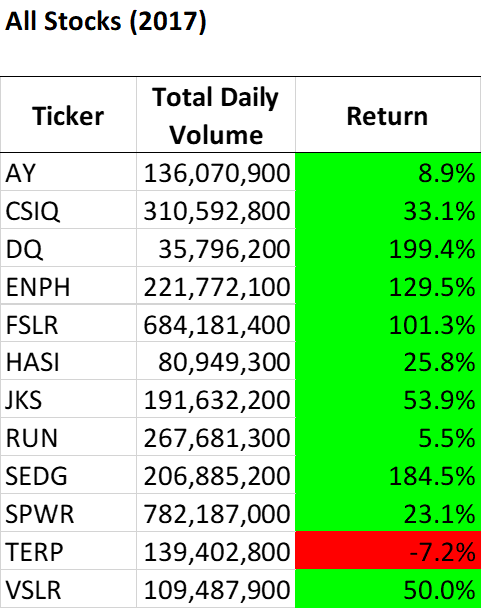
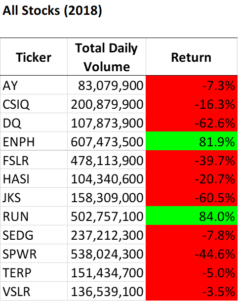
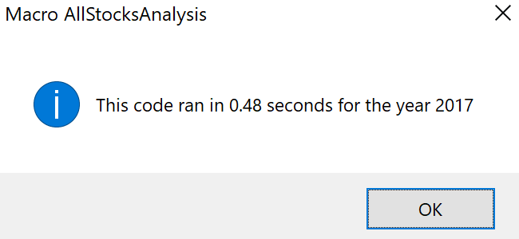
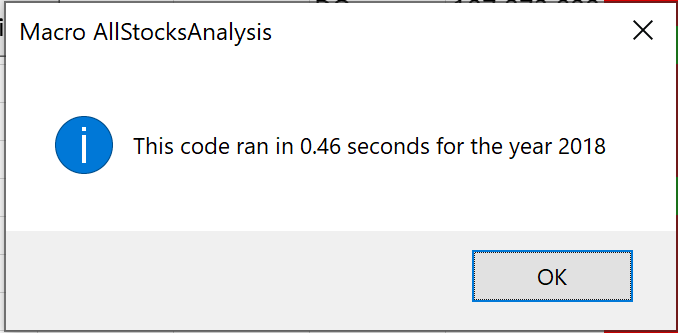
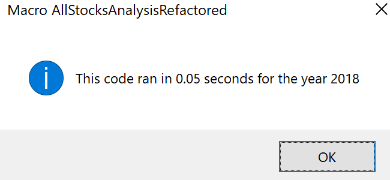

# Anaysis of Green Stocks

## Overview of Project  
The client, the financial advisor Steve, is analyzing the stock performance of DAQO New Energy Corp (DQ) and and eleven other green energy companies.  The Visual Basic for Applications (VBA) Macro **AllStocksAnalysis** was written to analyze these 12 stocks for an user-inputed year.  The client wishes to expand the dataset to include the stock market (i.e. increase the number of stocks from twelve to potentially thousands).
### Purpose
Demonstrate how the VBA Macro **AllStocksAnalysis** analyzes stock performance for 2017 and 2018, and refactor to optimize performance. 

## Analysis Results
### Stock Performance between 2017 and 2018

### Original AllStocksAnalysis Methodology
The original **AllStocksAnalysis** code followed the logic:
  1. Declare all variables
     - Request the user to specify the year of data to analyze
     - Confirm the year of data is available in the Excel file
     - Record the start time of code execution
  2. Format output worksheet title & headers
  3. Define the 12 tickers with a hardcoded array
  4. Analyze the stock data for each stock ticker
     - Find the total volume, starting price, and ending price
     - Calculate percent return
     - Write stock ticker, total volume, and percent return to the output sheet
  5. Report code execution time and end execution 

### Refactoring Methodology

### Code Performance (Original vs. Refactored)
As shown in the messages below, the original **AllStocksAnalysis** code analyzes a year's worth of stock data for twelve stocks in slightly less than 0.5 seconds. 

 
The Visual Basic Macro **AllStocksAnalysis** is available in Module ***Mod_2p3_AllStocksAnalysis*** of the Excel file:
[VBA_Challenge.xlsm](VBA_Challenge.xlsm)

When refactoring the code, 

 
The Visual Basic Macro **AllStocksAnalysisRefractored** is available in Module ***Mod_2_Challenge*** of the Excel file:
[VBA_Challenge.xlsm](VBA_Challenge.xlsm)

## Summary
What are the advantages or disadvantages of refactoring code?
How do these pros and cons apply to refactoring the original VBA script?
