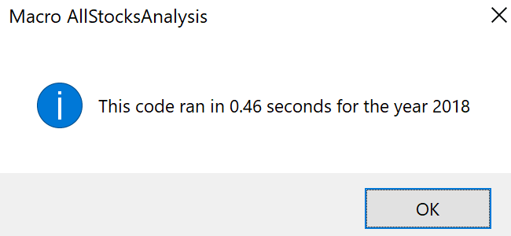

# Anaysis of Green Stocks

## Overview of Project  
The client, the financial advisor Steve, is analyzing the stock performance of DAQO New Energy Corp (DQ) and eleven other green energy companies.  The Visual Basic for Applications (VBA) Macro **AllStocksAnalysis** was written to analyze these 12 stocks for an user-inputed year.  The client wishes to expand the dataset to include the stock market (i.e. increase the number of stocks from twelve to potentially thousands).
### Purpose
Demonstrate how the VBA Macro **AllStocksAnalysis** analyzes stock performance for 2017 and 2018, and refactor to optimize performance. 

## Analysis Results
### Stock Performance between 2017 and 2018
The stock performance of DAQO New Energy Corp (DQ) and eleven other green energy companies are presented below.  While there was generally a positive return in 2017, most of the selected stocks showed subsequent losses in 2018.


<sup>The stock analyses were performed using the Macro-Enabled Excel file: [VBA_Challenge.xlsm](VBA_Challenge.xlsm)</sup>

### Original AllStocksAnalysis Methodology
The original **AllStocksAnalysis** code followed the logic:
  1. Declare all variables
     - Request the user to specify the year of data to analyze
     - Confirm the year of data is available in the Excel file
     - Record the start time of code execution
  2. Format output worksheet title & headers
  3. Define the 12 stock tickers with a *hardcoded* array
  4. Analyze the stock data for each stock ticker
     - Loop through each input sheet row to find the total volume, starting price, and ending price
     - Calculate percent return
     - Write stock ticker, total volume, and percent return to the output sheet
  5. Report code execution time and end execution 

The total volume is a simple sumation of all volumes for a particular stock ticker.
The percent return is calculated as:
```
EndingPrice / StartingPrice - 1
```
The full code for the VBA Macro **AllStocksAnalysis** is available in Module ***Mod_2p3_AllStocksAnalysis*** of the Excel file:
[VBA_Challenge.xlsm](VBA_Challenge.xlsm)

### Refactoring Methodology
The new **AllStocksAnalysisRefractored** code was refactored with the priorities:
  1. Assess a variable number of stocks
  2. Only loop through the input sheet rows once

To accomplish this, 4 array variables were declared:
```vba
    'Arrays
    Dim tickerIndex As Integer 'Counter for Ticker Arrays
    Dim tickers() As String 'Variable sized array of stock tickers
    Dim tickerVolumes() As Long 'Variable sized array of stock ticker volume sum
    Dim tickerStartingPrices() As Single 'Variable sized array of stock ticker starting prices
    Dim tickerEndingPrices() As Single 'Variable sized array of stock ticker ending prices
```
When looping through the input sheet rows, the code follows the logic:
  1. Check the stock ticker for the row
     - If this is the 1st row, initialize the arrays and add ticker to tickers(0)
     - If this is a new ticker, increase array sizes and add new ticker tickers array
  2. Increase the volume if it is the current stock ticker
  3. If this row has the starting price for the stock ticker, store it in the tickerStartingPrices array
  4. If this row has the ending price for the stock ticker, store it in the tickerEndingPrices array

The full code for the VBA Macro **AllStocksAnalysis** is available in Module ***Mod_2p3_AllStocksAnalysis*** of the Excel file:
[VBA_Challenge.xlsm](VBA_Challenge.xlsm)

### Code Performance (Original vs. Refactored)
As shown in the messages below, the original **AllStocksAnalysis** code analyzes a year's worth of stock data for twelve stocks in slightly less than 0.5 seconds.  For the refactored **AllStocksAnalysisRefractored** code, the execution time was nearly an order of magnitude faster.

 

<sub>The VBA Macro **AllStocksAnalysis** is available in Module ***Mod_2p3_AllStocksAnalysis*** of the Excel file:
[VBA_Challenge.xlsm](VBA_Challenge.xlsm)</sub>


 

<sub>The VBA Macro **AllStocksAnalysisRefractored** is available in Module ***Mod_2_Challenge*** of the Excel file:
[VBA_Challenge.xlsm](VBA_Challenge.xlsm)</sub>

## Summary
In general, refactoring code can potentially:
  1. Improve code efficiency by removal of redundancies and duplications.
  2. Extend code functionality by reducing hardcoded and "magic" numbers.
  3. Make the code easier to read with a cleaner structure. 
Conversely, refactoring can have the following disadvantages:
  1. The time spent refactoring may not may be longer than running the old code.
  2. If the original code is large or especially complex, refactoring may introduce errors that hard to track down.

In this particular case, the improvement of code performance is not significant if only run for the original 12 stocks.  However, the benefits are far more substantial if the new code is used to analyze additional stocks.  To start, with the original hardcoded tickers array, the code would have to modified whenever a new stock was to be analyzed.  It is also expected that the execution time will increase for both macros as more stocks are added to the stock list.  If thousands of stocks are analyzed, the potential execution time savings are much higher.
